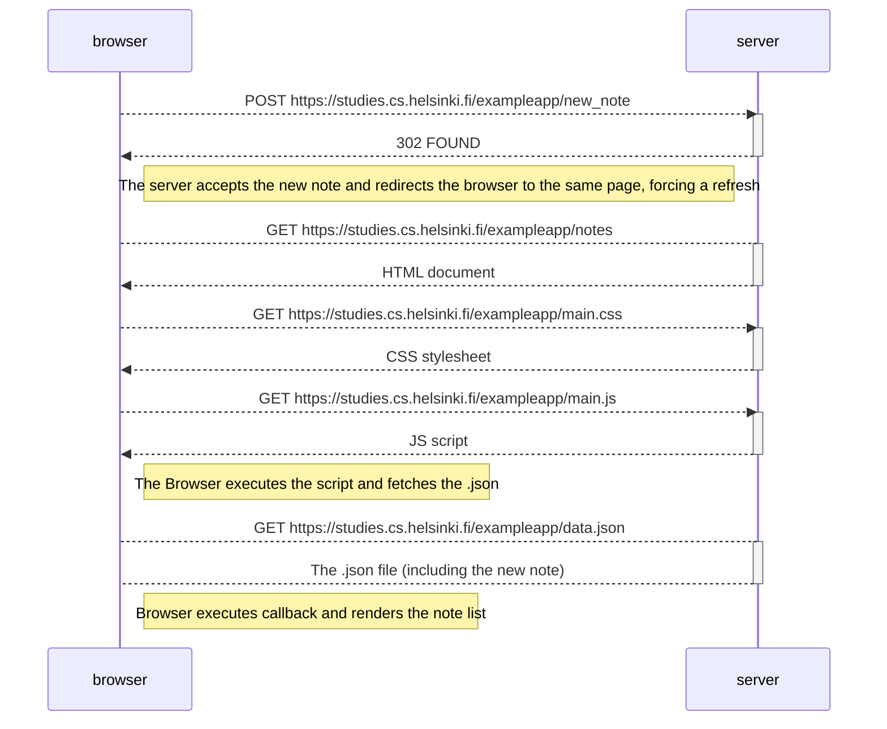

```mermaid
sequenceDiagram
    participant browser
    participant server

    browser-->>server: POST https://studies.cs.helsinki.fi/exampleapp/new_note
    activate server 
    server-->>browser: 302 FOUND
    deactivate server
    
    Note right of browser: The server accepts the new note and redirects the browser to the same page, forcing a refresh

    browser-->server: GET https://studies.cs.helsinki.fi/exampleapp/notes
    activate server
    server-->>browser: HTML document
    deactivate server

    browser-->>server: GET 	https://studies.cs.helsinki.fi/exampleapp/main.css
    activate server
    server-->>browser: CSS stylesheet
    deactivate server

    browser-->>server: GET https://studies.cs.helsinki.fi/exampleapp/main.js
    activate server
    server-->>browser: JS script
    deactivate server

    Note right of browser: The Browser executes the script and fetches the .json

    browser-->server: GET https://studies.cs.helsinki.fi/exampleapp/data.json
    activate server
    server-->browser: The .json file (including the new note)
    deactivate server

    Note right of browser: Browser executes callback and renders the note list
```