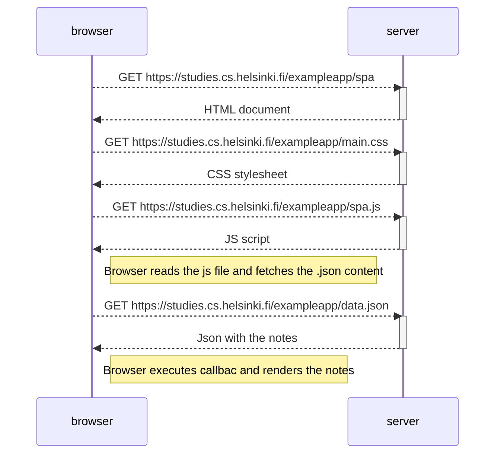

```mermaid
sequenceDiagram
    participant browser
    participant server

    browser-->>server: GET https://studies.cs.helsinki.fi/exampleapp/spa
    activate server
    server-->>browser: HTML document
    deactivate server

    browser-->>server: GET https://studies.cs.helsinki.fi/exampleapp/main.css
    activate server
    server-->>browser: CSS stylesheet
    deactivate server

    browser-->>server: GET https://studies.cs.helsinki.fi/exampleapp/spa.js
    activate server
    server-->>browser: JS script
    deactivate server

    Note right of browser: Browser reads the js file and fetches the .json content

    browser-->>server: GET https://studies.cs.helsinki.fi/exampleapp/data.json
    activate server
    server-->>browser: Json with the notes
    deactivate server

    Note right of browser: Browser executes callbac and renders the notes
```