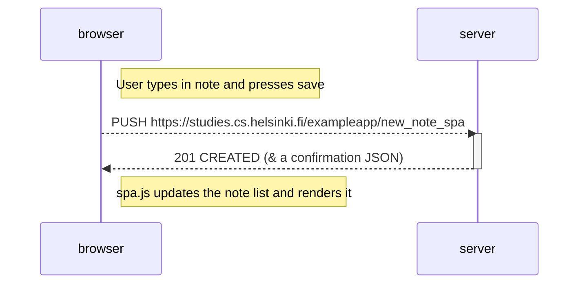

```mermaid
sequenceDiagram

    participant browser
    participant server

    Note right of browser: User types in note and presses save

    browser-->>server: PUSH https://studies.cs.helsinki.fi/exampleapp/new_note_spa
    activate server
    server-->>browser: 201 CREATED (& a confirmation JSON)
    deactivate server

    Note right of browser: spa.js updates the note list and renders it
```